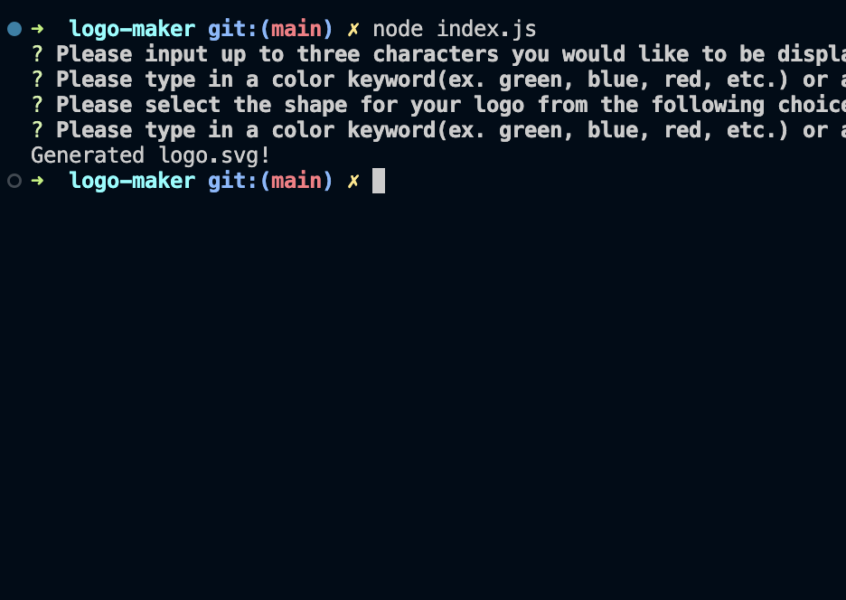

# Quick Logo Maker 

## Description

This project generates a simple logo in the form of an .svg file from the command line. The program can create a simple logo with up to three characters in the shape of either a circle, square or triangle. The user can choose the color for the text and the background image of the logo.

This application enables a user to easily create a vector logo when they want to save time making a simple logo for a project. This application utilizes the inquirer and jest npm packages. While working on this project I was also required to become more familiar with javascript classes, object constructors and deconstructors and gain a deeper understanding how they work. This was also a great exercise in using express and beginning to modularize projects; such as utilizing the classes declared in the shapes.js file in the index.js file.

## Installation

To use this applcation, clone the project directories and files from [the repository](https://github.com/sillytsundere/logo-maker) and open the index.js file in preferred code editor. The application can be run from the command line with the assistance of Node.js. When cloning the project the appropriate package.json files wil be cloned with it and the application will be ready ready to generate an svg logo based off user input.

## Usage

Navigate to the directory of the index.js file, if the index.js file is open in a code edior like VSCode then open the directory in an integrated terminal. Then from the command line initiate the program with 'node index.js' and answer the prompts to input text for your logo as well as select a shape from the three choices(circle, triangle, square) and input the colors you would like the text and background shape to be.

Below is an image of the console message once the user has answered all the prompts and the logo has been generated.

A video demonstrating the process of running the application cen be viewed at this link: [Example Demonstration](https://drive.google.com/file/d/1P1NTsNFbn5xho3q1t0eBlaPtsjhaVzNy/view?usp=sharing)

## License

## Badges

Badges sourced from: [Awesome Badges](https://dev.to/envoy_/150-badges-for-github-pnk)

## Questions

If you have any questions or would like to contribute please contact me at [my Github page](https://github.com/sillytsundere).

## Tests

This application comes with three tests, which can be seen in the shapes.test.js file. When The tests can be run, as the appropriate node dependency will be cloned with the repository; jest. In the command line, once navigated to the repo directory initiate the tests with 'npm run tests'. The test can also be viewed in the shapes.test.js file to see that the tests are checking to see if the svg tag contains the appropriate shape tag that corresponds to the user input; square, circle or triangle.
